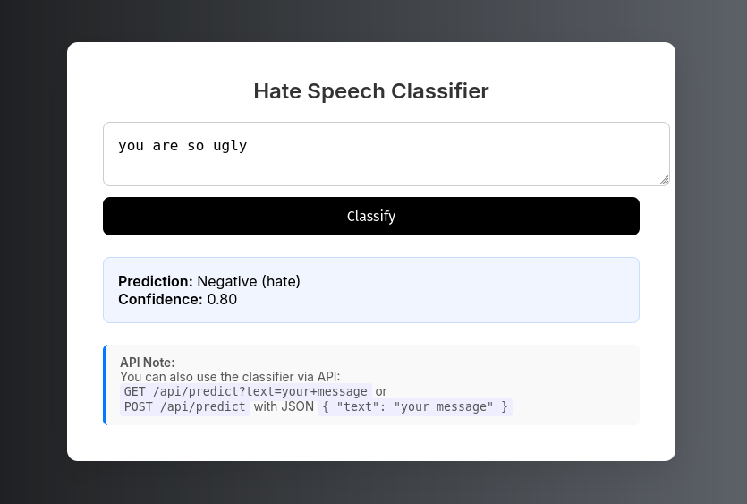

# **💬 Hate Speech Classification (Logistic Regression)**

[](https://hate-speech-detection.helinatefera.com/)


A simple Flask-based web application and API for classifying hate speech using a Logistic Regression model trained on TF-IDF vectorization.



## 📦 Requirements

- [**Python 3.10+**](https://www.python.org/downloads/release/python-3100/)
- [**Docker**](https://www.docker.com/) (optional, if deploying via container)

---

## 🚀 Running the Project

### 📁 Clone the Repository

Clone using SSH:

```bash
git clone git@github.com:helinatefera/Hate-Speech-Classification.git
cd Hate-Speech-Classification
```

### ⚙️ Installation (Local)

Clone the repository and install dependencies:

```bash
pip install -r requirements/local.txt
````

---

## 🧠 Training the Model

To train the model on the preprocessed dataset:

```bash
python3 train.py
```

This will generate a `pipeline.joblib` file that includes both the TF-IDF vectorizer and the trained classifier.

---

### 🔍 Running Predictions (CLI)

Once the model is trained, you can test it using:

```bash
python3 predict.py
```

You will get a response like:

```
Positive (non-hate) (0.95 confidence)
```

---

### 🌐 Web App & API

Run the Flask app:

```bash
python app/main_app.py
```

The app provides:

---

## 🐳 Docker Support

### Build the Docker image:

```bash
docker build -t hate-speech-app .
```

### Run the container:

```bash
docker run -d -p 8000:5000 hate-speech-app
```

Then visit:

```
http://localhost:8000
```


---

## 🔗 API Usage

### GET

```http
GET /api/predict?text=I love you
```

### POST

```http
POST /api/predict
Content-Type: application/json

{
  "text": "I hate you"
}
```

---

## 🧼 License

MIT License © helinatefera


## 📞 Contact

👤 **Helina Tefera**  
✉️ [E-Mail](mailto:helinatefera1212@gmail.com)  
📱 [Phone](tel:+251929453545)
